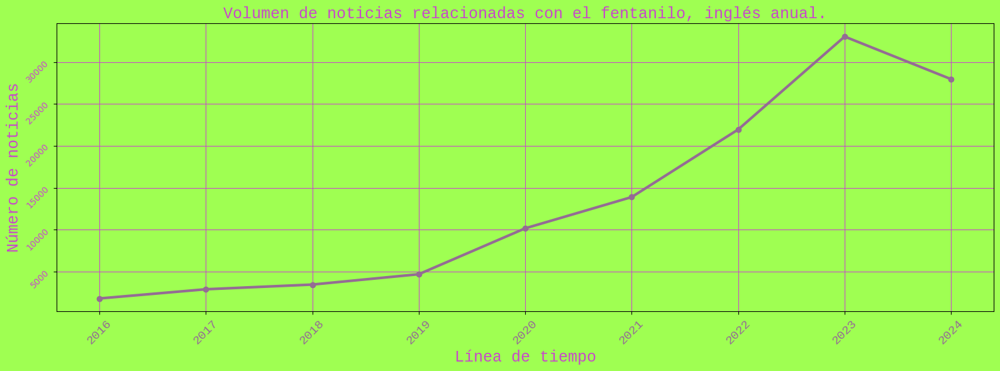
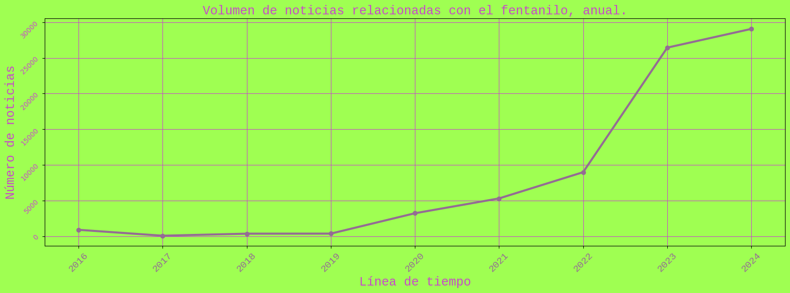
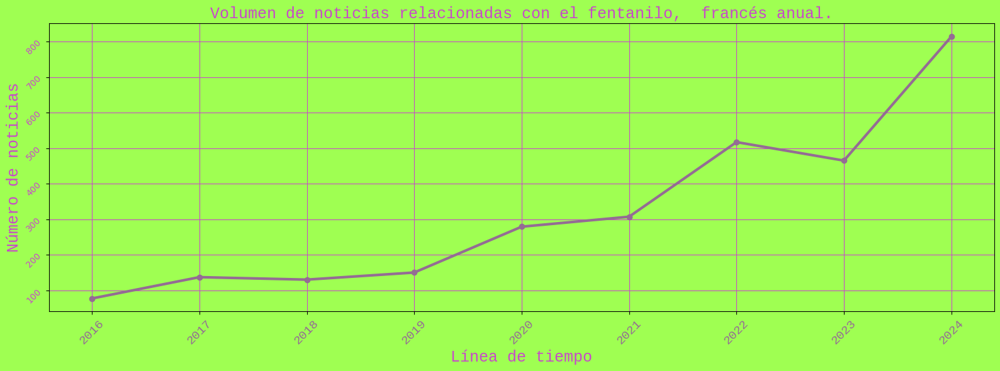

# Analisis-de-titulares-fentanilo-2016-2024
Tendencias y patrones en la cobertura mediática del fentanilo en América del Norte y Colombia, 2016 - 2024

##        Contexto del análisis

Existe un boom de información relacionada al fentanilo desde el 2016 que va de la mano con muchas cosas tales como; la declaración del gobierno provincial de Columbia Británica – Canadá de una crisis de fentanilo en abril de ese año, visibilización de los consumidores mientras se encuentran bajo su efecto, sobredosis, aumento de la oferta y demanda en el mercado negro, combinaciones peligrosas con otras sustancias, noticias criminales entorno a la sustancia, supuestas aperturas de nuevos mercados, entre otras tantas que en ocasiones son verdad, pero que en otras ocasiones son solo noticias que busca avivar las pasiones de las personas para traer clicks y visitas.

El uso de fentanilo es un problema que ha afectado de forma real y en gran cantidad a muchas personas en México, EE.UU y Canadá. Fuera de estos territorios, específicamente desde Colombia, se ha venido gestando un ambiente mediático opaco, en donde se refuerza la narrativa prohibicionista y donde se pronostica que el fentanilo va a destruir a los colombianos sin pruebas claras o análisis a profundidad. Es una herramienta discursiva que emplea toda la agenda mediática como gran aliada para seguir fortaleciendo los enfoques punitivos sobre las sustancias ilegales y para aumentar la represión en los eslabones más débiles de esta cadena de distribución, esto disfrazado de “preocupación por la comunidad” y la necesidad de “más seguridad”.

Teniendo todo esto en cuenta se plantea la razón de la necesidad de realizar este análisis descriptivo y exploratorio desde Colombia. Pese a que no somos un país que se haya visto mayormente afectado por la problemática relacionada al consumo de fentanilo, se usa al aparato mediático como forma de avivar este mensaje de preocupación por la sustancia y las tragedias que nos puede traer, ignorando problemas estructurales mayores que ya tenemos como la polarización, estigmatización, exclusión e incluso odio en contra de los eslabones más débiles de la cadena distribución de las sustancias como consumidores y pequeñas y pequeños expendedores, estos últimos, en su mayoría comunidad pobre buscando otras alternativas económicas para sus vidas.

El contexto anterior ayudará a entender la razón por la cuál para este análisis se accedieron a medios de comunicación en México, Canadá, EE.UU y Colombia tanto en inglés, francés y español.

##       Objetivos del proyecto

Objetivo principal: Analizar el cubrimiento mediático relacionado al fentanilo entre los años 2016-2024.

Objetivos generales: Identificar tendencias y patrones significativos.

Analizar qué tipo de impacto pueden tener estas noticias en la percepción pública y el comportamiento de las personas que las consumen.

##        Mapear datos

Luego de una revisión general y teniendo en cuenta el espacio de tiempo de los datos necesarios para el análisis se decidió extraer la información de 2 herramientas. Primero, una especializada en análisis de medios, Media Cloud y su API oficial, y segundo, uno de los agregadores de noticias más usados, Google News usando la librería BeautifulSoup para rascar la información.

Se decide hacer uso de ambas herramientas ya que Media Cloud es una herramienta muy completa pero no cuenta con bases de datos de información de antes del año 2020. En este punto entró Google News como complemento para extraer la información del año 2016 al 2019.

Teniendo en cuenta los países más cercanos a la problemática del fentanilo (Canadá, EE.UU, México) y el país desde donde se hace este análisis (Colombia), se decide extraer la información para el análisis en francés, inglés y español.
 
       
##        Obtener y cargar los datos

### Extracción de la información:

Como ya se mencionó anteriormente, para obtener la información necesaria para el análisis se usó  Media Cloud, una herramienta especializada para análisis de medios e investigación relacionada y también uno de los agregadores de noticias más populares, Google News.

*MediaCloud Api*

*MediaCloud Api*

*Google News y BeautifulSoup*

*BeautifulSoup*

### Limpieza de la información:

Pensando a otros análisis que se hagan a futuro en este punto se hace una primera limpieza de los datos revisando que todas las urls de donde se extrajeron las noticias sigan disponibles. Con esto se asegura de que más adelante, si se quiere obtener por ejemplo una captura de pantalla o información aparte de las columnas que están en el csv creado con los resultados, se podrá acceder a cualquier enlace porque todos deberían estar funcionando. Además de las url que no dieran respuesta, se limpiaron algunos registros que se salían de la estructura de las bases de datos por ejemplo, titulares que se cortaban en 2 o más partes y que se colaban en otras columnas, no fue un número significativo por lo que se eliminaron.

De aquí salieron 6 bases de datos; 3 con información extraída de Google News del año 2016 al año 2019 en inglés, francés y español; 3 con información extraída de Media Cloud del año 2020 al año 2024 en inglés, francés y español. Los resultados obtenidos desde ambas fuentes diferían en cuanto a los formatos de las fechas de publicación de las noticias, antes proceder a unir la información de Media Cloud y Google News, desde 2016 – 2019, agrupadas por idiomas, se solucionó este paso estableciendo un formato de fecha igual para toda la información (AAAA-MM-DD).

*Db fentanilo 2016 - 2024 español*

*Db fentanilo 2016 - 2024 inglés*

*Db fentanilo 2016 - 2024 francés*

**Para tener en cuenta:** Durante el proceso de limpieza se decidió a acceder a las urls de varias de las noticias extraídas y se pudo notar que aunque la palabra clave de consulta para la extracción de la información era fentanilo y fentanyl, en varias de las noticias esta palabra no aparece en el título, a veces aparece solo una vez o ni siquiera aparece en el cuerpo del texto. En algunos casos la palabra está es en notas o enlaces recomendados y en varias ocasiones no aparece en ningún lado del contenido del enlace.

Una mejora a futuro de este análisis va a tener que detallar porque varias noticias que no contienen la palabra fentanilo o fentanyl en ninguna parte del sitio web salen en los resultados de la consulta y buscar la manera para evitar que esto suceda.

##        Análisis exploratorio de los datos

### Análisis de series de tiempo:

Luego de tener toda la información recolectada en 3 bases de datos, cada una en un idioma (inglés, español y francés) se procedió a realizar el análisis exploratorio correspondiente.

Para esto se procedió 	a hacer un gráfico de líneas con la librería Matplotlib de python, en donde se pudiera observar el volumen de publicación de noticias de forma diaria desde el año 2016 hasta el año 2024 y otro en donde se grafica la tendencia de esta información.

*Volumen de publicación diario*

*Tendencia de publicación diario*

Ya se pueden ver algunos detalles muy claros en los datos como lo son; durante el periodo de tiempo seleccionado el numero de noticias en inglés ocupa el primer puesto en cuanto a cantidad y se ve que, junto a la información en español, tuvieron una tendencia a crecer rápidamente a medida que avanzaba el tiempo. Por su parte, las noticias en francés, fueron un número significativamente menor con una tendencia creciendo de forma muy moderada, esto debido principalmente a que la cantidad de personas que hablan inglés y español (Colombia, México, Canadá y EE.UU) es superior de las que hablan francés(Canadá). A continuación observamos los volúmenes de publicación de forma anual para los 3 idiomas.

*Volumen total anual en inglés*

*Volumen total anual en español*

*Volumen total anual en francés*

Las gráficas del volumen total anual de publicaciones en cada idioma confirman lo que se ve en los Gráficos de líneas 1 y 2. El volumen de publicaciones y tendencias van aumentando al ir pasando el tiempo, incluso se puede ver en el Gráfico de líneas 5 con mayor claridad lo que se observa en el Gráfico de Líneas 2, la tendencia de crecimiento moderado de las publicaciones anuales en francés.

Como ya se dijo en este documento, luego de la extracción de los datos se pudo notar que en varias de las noticias la palabra ‘fentanilo’ o ‘fentanyl’ en inglés y francés, no aparece ni en el título, ni siquiera aparece en el cuerpo del texto o en algunos casos la palabra está es en las notas o enlaces recomendados de la página. Esto, sumado a que muchos titulares se repiten constantemente con cambios en ligeros cambios en los enlaces, debido a las distribuciones de los medios web y de los medios de comunicación, hace necesario hacer 2 filtros para complementar el análisis de los datos.

En primer lugar se agrupan aquellos enlaces que repiten el mismo titular, aunque en el gráfico se puede ver que el volumen y tendencia de publicación tienen similitudes, los picos máximos y el número de noticias en inglés y español que se publicaron ese día descienden considerablemente, no pasa lo mismo con los datos en francés. 

*DB fentanilo 2016 - 2024 español, títulos agrupados*

*DB fentanilo 2016 - 2024 inglés, títulos agrupados*

*DB fentanilo 2016 - 2024 francés, títulos agrupados*

*Volumen total diario con filtro*

Tanto el volumen y tendencia de publicación de noticias puede obedecer a la distribución y culturas mediáticas en cada país, la forma de abarcar el tema y el objetivo que se tiene al hacerlo, por ejemplo en las notas recolectadas de Colombia y México, algunas noticias no tienen que ver directamente con el fentanilo pero al referirse al crimen organizado, política, accidentes o farándula se incluye si o si la palabra en la noticia, así no tenga nada que ver con el contexto de la nota. Un ejemplo claro es cuando alguien reconocido muere por sobredosis y aún sin que sea verdad, los medios dicen que presuntamente fue por fentanilo. Es una estrategia de posicionamiento web que va de la mano con lo que quiere vender cada medio.

Si la gente está interesada en consumir cosas relacionadas al fentanilo, desde la perspectiva que sea, el usar esa palabra de manera constante en las publicaciones del sitio, sea necesario o no, obviamente va a aumentar su visibilidad en los resultados de los buscadores y redes sociales.

Tanto el volumen y tendencia de publicación de noticias puede obedecer a la distribución y culturas mediáticas en cada país, la forma de abarcar el tema y el objetivo que se tiene al hacerlo, por ejemplo en las notas recolectadas de Colombia y México, algunas noticias no tienen que ver directamente con el fentanilo pero al referirse al crimen organizado, política, accidentes o farándula se incluye si o si la palabra en la noticia, así no tenga nada que ver con el contexto de la nota. Un ejemplo claro es cuando alguien reconocido muere por sobredosis y aún sin que sea verdad, los medios dicen que presuntamente fue por fentanilo. Es una estrategia de posicionamiento web que va de la mano con lo que quiere vender cada medio.

Si la gente está interesada en consumir cosas relacionadas al fentanilo, desde la perspectiva que sea, el usar esa palabra de manera constante en las publicaciones del sitio, sea necesario o no, obviamente va a aumentar su visibilidad en los resultados de los buscadores y redes sociales.

Aunque es algo que también sucede en los titulares que están en francés, la visión de cada país de alguna manera u otra impacta en la agenda mediática. Más adelante se detallará mejor gracias al análisis de texto de los titulares de las noticias. 
Luego de haber agrupado los titulares que se repetían y los enlaces de las noticias se procedió con el segundo filtro, en este caso se trabajó solo con los titulares que incluyen la palabra fentanilo. Se puede observar que el número de noticias se reduce de gran manera otra vez, incluso en francés. Aunque los Gráficos de líneas 1 y 3 tienen similitudes, se puede ver que la magnitud del eje y, el eje vertical, disminuyen en gran medida, la tendencia no tiene muchas variaciones.

*DB fentanilo 2016 - 2024 español, títulos agrupados con la palabra fentanilo presente*

*DB fentanilo 2016 - 2024 inglés, títulos agrupados con la palabra fentanilo presente*

*DB fentanilo 2016 - 2024 francés, títulos agrupados con la palabra fentanilo presente*

*Volumen total diario con el segundo filtro*

*Volumen total diario con el segundo filtro*

Con el segundo filtro se asegura que los datos van a mencionar la palabra fentanilo 1 vez dentro de la noticia, no como enlace, nota o video sugerido, aunque eso no asegura que todas las noticias tengan al fentanilo como foco de atención o que no sea una palabra usada para atraer visitas y lecturas.

Otra anotación importante y que no es tan clara en estos gráficos es la estacionalidad (repetición cada cierto período de tiempo idéntico de ciertos fenómenos) que presentan los datos. Cada cierto periodo de tiempo se presentan ciertos picos y valles en los gráficos. Esto puede obedecer a diferentes razones entre los cuales se intuye el interés y las agendas mediáticas relacionadas al fentanilo, por ejemplo avances en las investigaciones de muertes de artistas por sobredosis o incautaciones de la sustancia.

*Estacionalidad de publicación de noticias inglés*

*Estacionalidad de publicación de noticias español*

*Estacionalidad de publicación de noticias francés*

### Análisis de texto:

Para este punto de análisis, a diferencia del anterior, solo se va a usar los datos agrupados por título y que además contienen la palabra ‘fentanilo’. En primer lugar se hace el procesamiento de los titulares de las noticias para eliminar caracteres especiales como tildes, comas, entre otras y también se eliminan  conjunciones, artículos, preposiciones y adverbios como ante, antes, aún, aunque, aquí, arriba, atrás así, bajo, entre otras tantas que no aportarán nada pero que si afectarían los siguientes procedimientos. Esto se hizo usando las librerías de python, spacy, nltk y re.
El siguiente paso, teniendo los titulares de las noticias procesados, es hacer un conteo de las palabras que más se repiten dentro de todos los datos y graficar una nube de palabras, haciendo uso de las librerías WordCloud, collections y PIL, para ver cuál es el contexto general de la información que se ha reunido.

Gracias al análisis de texto de los titulares de las noticias se puede observar claramente que la palabra mas recurrente en las nubes de palabras en inglés, español y francés es la palabra fentanilo con un contexto ampliamente relacionado al crimen, otras sustancias y la muerte. 
En la nube de palabras en inglés algunas de las palabras que más resaltan son charge (cargo), overdose (sobredosis), police (policía), death (muerte), entre otras.

*Nube de palabras en inglés*

Sobredosis, muerte, tráfico, metanfetamina, cocaína, píldora entre muchas otras palabras resaltan tanto en inglés como en español.

*Nube de palabras en español*

Debido a la estrategia de reducción de daños a nivel nacional que tiene Canadá, en la nube de palabras en francés se observan brevemente y de forma reducida las palabras naloxona y medicina. Aunque no salen como las palabras más relevantes dentro del gráfico, el compromiso nacional con la reducción de daños ha calado un poco en las narrativas mediáticas.

*Nube de palabras en francés*

##        Conclusiones
- Durante el 2020 – 2024 el volumen de publicaciones en inglés y español tiene un mayor crecimiento que entre el 2016 – 2019 en donde se ve una tendencia más moderada. Lo anterior coincide con el récord histórico de muertes por sobredosis en EE.UU en 2020, una cantidad de muertes que no se veía desde finales de los años noventa y lo cuál pudo haber influido en el volumen de publicaciones de noticias relacionadas al fentanilo.
  
- La publicación de noticias en francés mantiene una tendencia neutra a lo largo del 2016 – 2024. En ningún momento tiene cambios significativos.
  
- El contexto de la mayoría de las palabras que se agrupan en la nube de palabras, luego del procesamiento de los titulares de las noticias, es de punitividad, seguridad, crimen, negocio y muerte.
  
- La política nacional de reducción de daños que tiene Canadá puede estar influyendo,de manera muy tímida aún, en la agenda mediática de ese país. Solo en la nube de palabras en francés se pueden ver levemente representadas las palabras naloxona y medicina, además solo la tendencia de noticias en francés tiene una tendencia neutra desde el 2016 – 2024.
